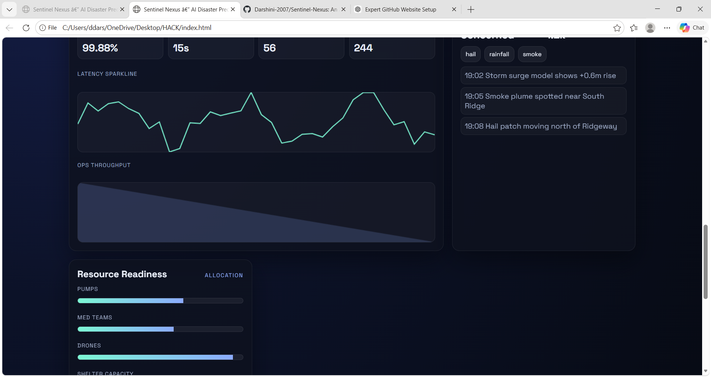

# Sentinel Nexus — AI Disaster Prediction System

An AI-inspired web application that simulates disaster prediction and response using satellite, weather, and sensor signals. Built as a high‑fidelity hackathon prototype with a live risk field, explainability, telemetry, and alert workflows.

## Demo



## Features
- Live risk field canvas with hazard switching
- Explainability drivers and methods
- Operational telemetry graphs
- Simulation controls and scenario impacts
- Multi‑language alert preview
- WhatsApp notifications (demo UI success)
- Jenkins pipeline for CI artifacts

## Tech Stack
- HTML
- CSS
- JavaScript
- Python (local WhatsApp gateway)

## How to Run
1. Clone the repo
2. Open `index.html` in your browser
3. (Optional) Start the local WhatsApp gateway

## WhatsApp Notifications
The UI shows success for demo purposes. For real sends:
1. Set credentials (new terminal required after `setx`):
   - `setx WHATSAPP_PHONE_NUMBER_ID "YOUR_PHONE_NUMBER_ID"`
   - `setx WHATSAPP_ACCESS_TOKEN "YOUR_ACCESS_TOKEN"`
2. Start the gateway:
   - `python whatsapp_server.py`

## Project Structure
```
ai-disaster-prediction/
├── index.html
├── style.css
├── script.js
├── images/
│   └── demo.png
├── assets/
│   └── icons/
│       └── alert.svg
├── README.md
├── LICENSE
└── Jenkinsfile
```

## Architecture
- UI: static HTML/CSS/JS with canvas visualizations
- Data: simulated telemetry and alerts in client‑side JS
- Notifications: optional Python gateway for WhatsApp

## Prototype
- Designed to communicate risk fast: color‑coded signals, explainability, and rapid alerts
- Built for hackathons and demo presentations

## Live Demo
- Enable GitHub Pages in repo settings to publish `index.html`
- Example URL: `https://username.github.io/projectname`

## Future Scope
- Live API integrations (NOAA/USGS, satellite feeds)
- Real model inference pipeline + alert routing
- Multi‑channel notifications (SMS, WhatsApp, email)
- Incident timeline and case management

## Jenkins Pipeline
A Jenkins pipeline is included in `Jenkinsfile` and archives static site assets.

## License
MIT License
